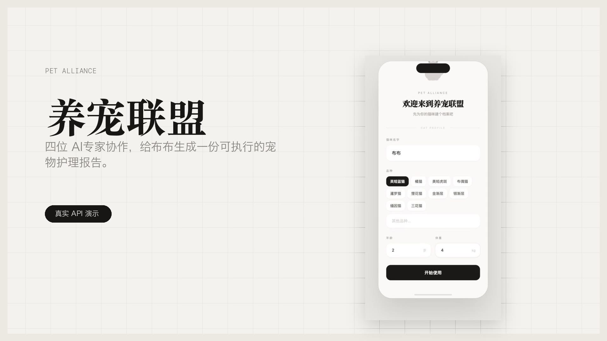

# PetAlliance 养宠联盟


PetAlliance 是一个面向宠物主的多智能体宠物护理咨询系统。它把一次模糊的养宠问题拆解给医疗、健康、饮食、寄养四个专业 Agent 协作处理，并把被验证有效的建议沉淀为可复用的经验基因。

## 解决什么痛点

宠物主遇到猫咪呕吐、精神差、食欲下降、皮肤异常、出差寄养等问题时，通常会遇到几个现实困难：

- **信息碎片化：** 搜索结果、论坛经验和通用 AI 回答往往互相矛盾，宠物主很难判断应该先处理医疗风险、饮食调整还是日常护理。
- **缺少宠物上下文：** 同一个症状对不同年龄、体重、品种和用药状态的宠物意义不同，但普通问答通常不会持续维护宠物档案。
- **建议不可执行：** 很多回答只给泛泛提醒，没有优先级、观察窗口、风险边界和后续动作，宠物主仍然不知道下一步该做什么。
- **经验无法沉淀：** 一次有效处理经验很难被系统记住，后续相似问题仍然从零开始问，无法形成越用越懂宠物的知识网络。

PetAlliance 的目标是把“我该怎么办”的焦虑问题，转成一份带宠物档案、专家协作、优先级判断和经验沉淀的护理建议。

## 演示视频

[](docs/demo/pet-alliance-demo.mp4)

点击上方封面可以查看 22 秒完整演示视频，流程包含：创建布布档案、提交真实问题、多 Agent 协作生成报告、反馈沉淀经验、进入经验基因库。

视频音乐来自 [Pixabay - Product Launch Advertisement Commercial Music by HitsLab](https://pixabay.com/music/future-bass-product-launch-advertisement-commercial-music-301409/)，按 [Pixabay Content License](https://pixabay.com/service/license-summary/) 使用。

## 核心能力

- **宠物档案：** 记录宠物姓名、品种、年龄、体重等基础上下文。
- **多 Agent 协作：** 医疗、健康、饮食、寄养 Agent 并行提出建议，再由编排器处理冲突和优先级。
- **真实咨询链路：** 前端提交问题后调用后端 `/api/consult`，通过 LLM 生成结构化建议。
- **反馈闭环：** 用户标记建议有效后，系统抽取可复用经验，写入基因库。
- **GEP 经验继承：** 后续相似咨询可继承匹配经验，让系统持续进化。

## 系统架构

```
用户提问
  │
  ▼
┌──────────────────────────────────────────────────┐
│           PetOrchestrator（5 阶段管线）            │
│                                                  │
│  1. 解析 ─── LLM 从自然语言中提取症状、紧急程度、   │
│              相关领域                              │
│                                                  │
│  2. 基因继承 ─── 获取匹配的基因配方，注入智能体提示词 │
│                                                  │
│  3. 并行提案 ─── 相关领域的智能体并发生成方案        │
│              （Promise.allSettled）                │
│                                                  │
│  4. 冲突解决 ─── LLM 检测冲突 + 协商（最多 5 轮）    │
│              优先级：医疗 > 健康 > 饮食 > 寄养       │
│                                                  │
│  5. 去重 ─── Jaccard 相似度过滤，返回前 2 条建议     │
└──────────────────────────────────────────────────┘
  │
  ▼
┌────────┐ ┌────────┐ ┌────────┐ ┌────────┐
│ 医疗    │ │ 健康   │ │ 饮食    │ │ 寄养   │
│ Agent  │ │ Agent  │ │ Agent  │ │ Agent  │
└────────┘ └────────┘ └────────┘ └────────┘
  │           │          │          │
  └───────────┴──────────┴──────────┘
                  │
           ConstraintBus
         （发布/订阅消息总线）
```

### 基因进化协议（GEP）

GEP 实现跨咨询的知识共享。当用户提交正向反馈时，系统通过 LLM 提取治疗"基因"并发布到 EvoMap 网络。后续咨询会继承匹配的基因，持续改进推荐质量。

```
用户反馈 → 基因提取 → 发布到 EvoMap
                            ↕
后续咨询 ← 获取匹配基因
```

## 快速开始

### 前置要求

- Node.js >= 18
- npm

### 安装

```bash
git clone <repo-url>
cd pet-alliance
npm install
```

### 配置环境变量

创建 `.env` 文件：

```env
LLM_API_KEY=your-api-key
LLM_BASE_URL=https://api.openai.com/v1    # 任意 OpenAI 兼容端点
LLM_MODEL=gpt-4o
PORT=3001

# GEP（可选）
GEP_HUB_URL=https://evomap.ai
GEP_NODE_ID=
EVOMAP_NODE_SECRET=
A2A_HUB_URL=http://localhost:8080
A2A_NODE_ID=petalliance-node-01
```

### 启动开发环境

```bash
# 终端 1 — 后端（端口 3001，热重载）
npm run dev

# 终端 2 — 前端（端口 5174）
cd web && npx vite --host 0.0.0.0 --port 5174
```

打开 `http://localhost:5174`，前端会将 `/api` 请求代理到 `localhost:3001`。

### 生产构建

```bash
npm run build
npm start
```

## API 接口

| 方法 | 路径 | 说明 |
|------|------|------|
| `POST` | `/api/consult` | 发起多智能体咨询 |
| `POST` | `/api/feedback` | 提交反馈（触发基因进化） |
| `GET` | `/api/messages/stream` | SSE 实时智能体事件流 |
| `POST` | `/api/pets` | 创建宠物档案 |
| `GET` | `/api/pets` | 获取宠物列表 |
| `GET` | `/api/pets/:id` | 获取宠物详情 |
| `GET` | `/api/genes` | 获取基因配方列表 |
| `POST` | `/api/genes/publish` | 发布基因 |
| `GET` | `/api/genes/fetch?condition=X` | 从 EvoMap 获取基因 |
| `DELETE` | `/api/genes` | 清空所有基因 |
| `GET` | `/api/health` | 健康检查 |

### 咨询示例

```bash
# 创建宠物
curl -X POST http://localhost:3001/api/pets \
  -H 'Content-Type: application/json' \
  -d '{"name":"咪咪","species":"cat","breed":"英短","age":3,"weight":4.5}'

# 发起咨询
curl -X POST http://localhost:3001/api/consult \
  -H 'Content-Type: application/json' \
  -d '{"petId":"<pet-id>","text":"我家猫最近两天一直呕吐，不吃东西"}'
```

## 项目结构

```
src/
├── index.ts                    # Express 服务入口 & 路由定义
├── types.ts                    # 共享 TypeScript 类型
├── agents/
│   ├── base.ts                 # 抽象基类 BaseAgent（LLM、基因继承、消息总线）
│   ├── medical.ts              # 医疗智能体（症状分析、诊断、治疗方案）
│   ├── health.ts               # 健康智能体（疫苗、驱虫、健康评估）
│   ├── diet.ts                 # 饮食智能体（营养方案、喂养指导）
│   └── boarding.ts             # 寄养智能体（寄养方案、交接清单）
├── orchestrator/
│   ├── petOrchestrator.ts      # 5 阶段咨询编排管线
│   └── constraintBus.ts        # EventEmitter 发布/订阅消息总线
├── gep/
│   ├── client.ts               # GepClient（发布、获取、清空基因）
│   ├── a2aBridge.ts            # A2A 传输层（文件 + HTTP 到 EvoMap）
│   ├── assetBuilder.ts         # 基因/胶囊/进化事件资产构建器
│   ├── hashUtils.ts            # SHA-256 规范化 JSON 哈希
│   └── recipes.ts              # 本地基因配方持久化
├── evolution/
│   └── geneExtractor.ts        # LLM 驱动的基因提取（从用户反馈）
├── memory/
│   └── petProfile.ts           # SQLite 宠物档案存储（WAL 模式）
└── utils/
    ├── llm.ts                  # OpenAI 兼容 LLM 客户端
    └── logger.ts               # 结构化日志

web/
├── index.html                  # HTML 入口 + Tailwind CDN
├── vite.config.ts              # Vite 配置（代理 /api → :3001）
└── src/
    ├── main.tsx                # React 挂载入口
    └── App.tsx                 # 单文件 SPA（中文界面）
```

## 技术栈

- **后端：** TypeScript (ES2022, ESM)、Express、better-sqlite3
- **前端：** React 18、Vite、Tailwind CSS
- **LLM：** OpenAI SDK（支持任意 OpenAI 兼容端点）
- **协议：** GEP 基因进化协议（跨智能体知识共享）、A2A 文件/HTTP 传输

## 许可证

MIT
